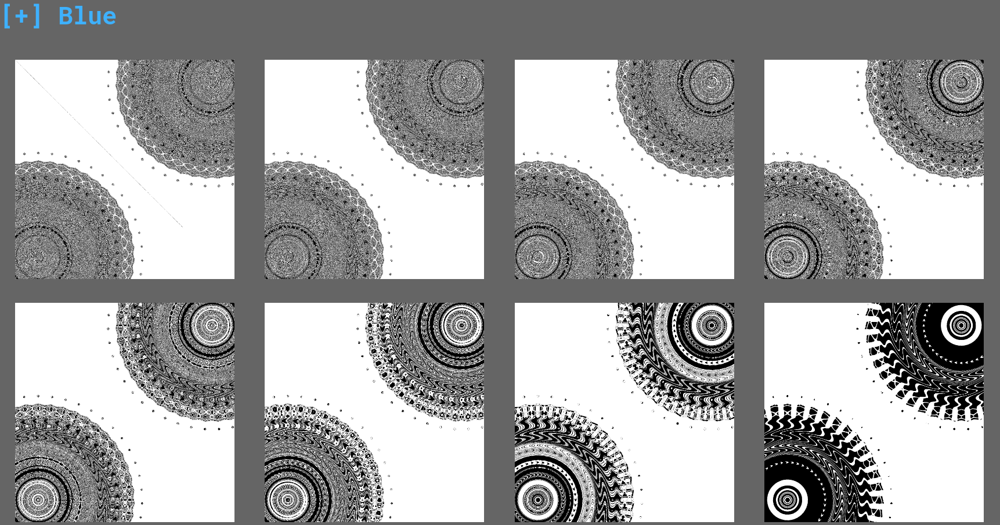

# LSD \#3

## Enunciado del Reto

>Don't try to throw random tools at this poor image. Go back to the basics and learn the detection techniques. Good luck!

## Archivos

- [secret.png](./secret.png)

- - -

## Solución

El título del reto nos da una pista bastante importante: LSD puede referirse en realidad al LSB (Least-Significant Bit). Sabiendo esto podemos intuir que existe algo escondido en el último bit de alguno de los canales de color de la imagen.

Cuando hay que buscar entre los canales de color, lo primero que se me viene a la mente son herramientas como **steghide** o [aperisolve](https://www.aperisolve.com/). En este caso usaremos esta segunda.

Tras subir la imagen, podemos ver que en el canal azul hay algo extraño.



Descargamos esa imagen para ver mejor de que se trata.


Tenemos lo que parece ser un mensaje codificado en binario en la diagonal de la imagen. Haremos un pequeño script para extraer el mensaje.

```python
from PIL import Image
import sys

def binaryToString(binary):
    return ''.join([chr(int(binary[i:i+8], 2)) for i in range(0, len(binary), 8)])

try:
    filename = sys.argv[1] if len(sys.argv)==2 else "secret.png"
    img = Image.open(filename,"r")
except:
    print("File not found")
    exit(1)
    
print(f"Decoding {filename}")
    
width, height = img.size
x,y = 0,0
salida = ""
while x < width and y < height:
    pixel = list(img.getpixel((x,y)))
    salida += str(pixel[2] & 1)
    x +=1
    y+=1    
    
with open("output.txt","w") as file_out:
    file_out.write(binaryToString(salida))    
```
[script.py](./script.py)

Este script recorre la diagonal de la imagen y extrae el bit menos significativo del canal azul. Luego transforma la string codificada en binario a ascii.

>~~~
>$ cat output.txt
>Steganography is the technique of concealing sensitive information in a seemingly innocuous cover medium. Here is your flag: Hero{L5B_D14G0N4L3}ÿÿÿÿÿÿÿÿÿÿÿÿÿÿÿÿÿÿÿÿÿÿÿÿÿÿÿÿÿÿÿÿÿÿÿÿÿÿÿÿÿÿÿ
>~~~

## Flag

```
Hero{L5B_D14G0N4L3}
```