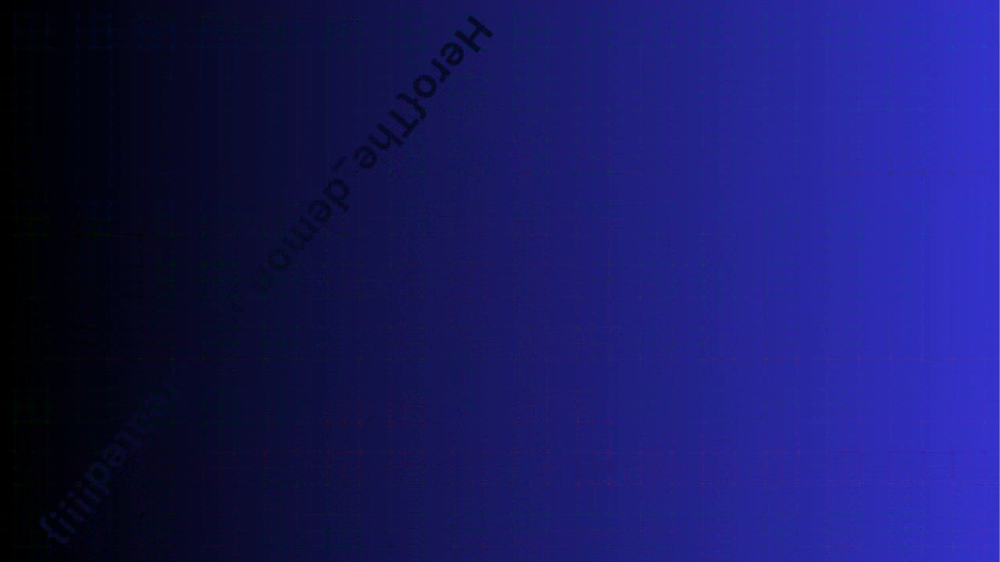

# Subliminal \#2

## Enunciado del Reto
>~~~
>The yellow demon triangle is back, even harder than before... An image has been hidden in this video. Don't fall into madness.
>Little squares size : 20x20 pixels
>~~~

## Archivos

- [subliminal_hide.png](./subliminal_hide.mp4)

- - -

## Solución

Abrimos el video y vemos que hay un cuadrado que avanza frame a frame verticalmente, columna a columna. Podemos intuir que la flag se obtiene combinando todos estos cuadrados. Además nos dicen en el enunciado que el cuadrado es de 20x20px.

Obtendremos la imagen escondida con el siguiente script.

```python
import cv2
import numpy as np

video = cv2.VideoCapture("salida.mp4")

width, height = int(video.get(3)), int(video.get(4))

salida = np.zeros((height,width,3),np.uint8)

i = 0
j = 0
while True:
    end,frame = video.read()
    
    if not end:
        break
    
    
    y = i % (height // 20) * 20
    x = i // (height // 20) * 20
    salida[y:y+20, x:x+20] = frame[y:y+20, x:x+20]
    i += 1
    
    
cv2.imwrite("salida2.bmp",salida)
video.release()
```
[script.py](./script.py)

El script abre el video y lo recorre frame a frame. Para cada frame, extrae el cuadrado y lo pega en una imagen de salida en la misma posición. Tras terminar obtenemos la imagen escondida.



La flag no es del todo visible. Usando cualquier editor de imágenes podemos jugar con la saturación y los niveles de color para hacerla más visible.


## Flag

```
Hero{The_demon_is_defeated!!!!}
```