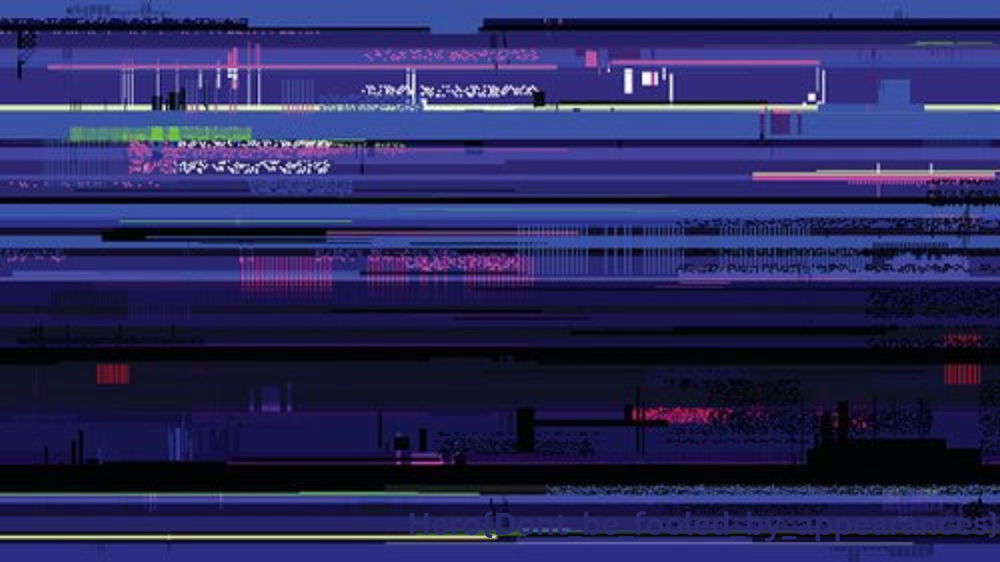

# Zipper

## Enunciado del Reto
>~~~
>Some data has been hidden somewhere in this archive, good luck finding it!
>~~~

## Archivos

- [secretzip.zip](./secretzip.zip)

- - -

## Solución

Extraemos el contenido del zip para ver que contiene.

>~~~
>$ unzip secretzip.zip
>Archive:  secretzip.zip
>   creating: whatiszip/
>   inflating: whatiszip/zipheader.png
>   inflating: whatiszip/ZIP.pdf
>   inflating: whatiszip/zipformat.png
>~~~

Podemos intuir que existe algún tipo de archivo oculto en el zip, que no se está extrayendo. Esto se debe a que el tamaño del zip es bastante mayor a la suma de los ficheros extraidos.

>~~~
>$ du -sh secretzip.zip whatiszip
>   884K	secretzip.zip
>   100K	whatiszip
>~~~

Para estos casos, la mejor herramienta es binwalk.

>~~~
>$ binwalk secretzip.zip 
>
>DECIMAL       HEXADECIMAL     DESCRIPTION
>--------------------------------------------------------------------------------
>0             0x0             Zip archive data, at least v1.0 to extract, name: whatiszip/
>68            0x44            Zip archive data, at least v2.0 to extract, compressed size: 31563, uncompressed size: 33944, name: whatiszip/zipheader.png
>31712         0x7BE0          Zip archive data, at least v2.0 to extract, compressed size: 27706, uncompressed size: 28510, name: whatiszip/ZIP.pdf
>59493         0xE865          Zip archive data, at least v2.0 to extract, compressed size: 29125, uncompressed size: 31304, name: whatiszip/zipformat.png
>88699         0x15A7B         PNG image, 1280 x 720, 8-bit/color RGBA, non-interlaced
>90037         0x15FB5         Zlib compressed data, default compression
>901578        0xDC1CA         End of Zip archive, footer length: 22
>~~~

Efectivamente, podemos ver que hay una imagen PNG escondida en el fichero zip. Para extraerla utilizaremos binwalk también.

>~~~
>$ binwalk --dd=".*" secretzip.zip
>~~~

Obtenemos la imagen con la flag.



## Flag

```
Hero{Dont_be_fooled_by_appearances}
```