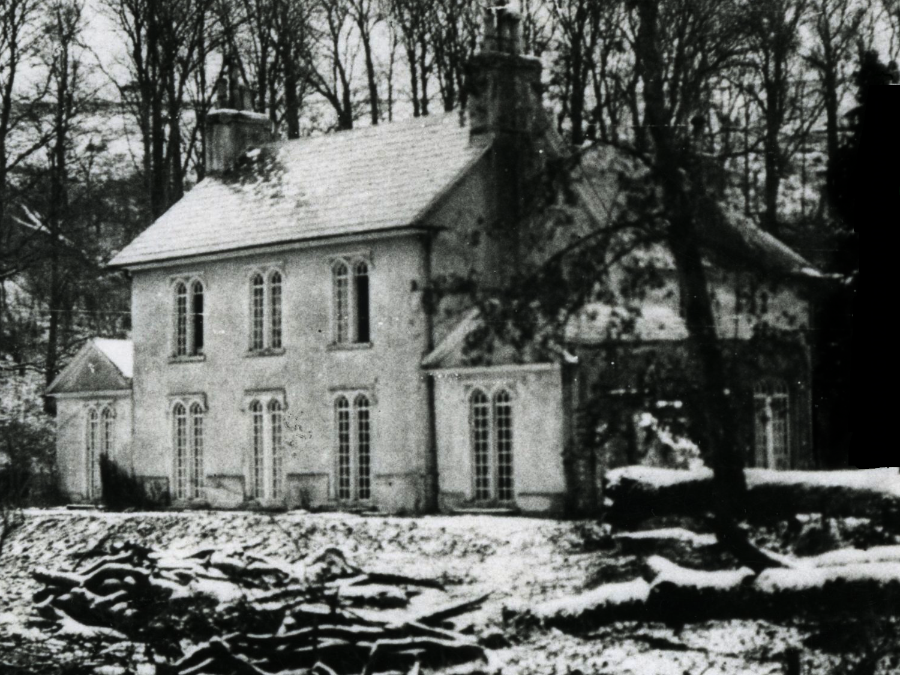

# Magia Azul

## Enunciado del Reto

>Encontramos esta foto antigua de la casa una bruja. El dueño nos dijo que la encontró en un "canal" y que antes de llevarsela le quitó la magia. ¿A qué se referirá?

## Archivo

- [CasaBruja.png](./CasaBruja.png)

## Hints

- En la cabecera de los archivos suele existir un llamado **"Número mágico"** que nos indica el tipo de archivo con el que estamos trabajando. ¿Qué le pasa al de esta imagen?
- El canal que se menciona en el reto se puede referir a los distintos canales de color que existen en una imagen. Programas como _GIMP_ o algunos más especializados como _steghide_ pueden ayudar a aislar dichos canales.

- - - 
## Solución

Al intentar abrir la imagen con cualquier visualizador vemos que nos da un error, al parecer el archivo está corrupto. El comando display nos puede dar alguna pista más de lo que ocurre.

>~~~
>$ display CasaBruja.png
>display-im6.q16: improper image header `CasaBruja.png' @ error/png.c/ReadPNGImage/4107.
>~~~

Como vemos, la cabecera del fichero parece haber sido corrompida.

Muchos ficheros incorporan en su cabecera un "Número mágico", que sirve para identificar con que tipo de fichero se está trabajando. En este caso, el número mágico de una imagen tipo PNG es: `89 50 4E 47 0D 0A 1A 0A`

Si abrimos la imagen en un lector hexadecimal, veremos que parte de dicho número mágico ha sido eliminado.

> ~~~
>$ xxd CasaBruja.png | head
>00000000: 0000 0000 0d0a 1a0a 0000 000d 4948 4452  ............IHDR
>00000010: 0000 05dc 0000 0465 0806 0000 00a3 8705  .......e........
>00000020: 6d00 0000 0662 4b47 4400 0000 0000 00f9  m....bKGD.......
>00000030: 43bb 7f00 0020 0049 4441 5478 da6c bd69  C.... .IDATx.l.i
>~~~

Ahora lo que debemos hacer es corregir el número para que se corresponda con el de una imagen PNG, usando cualquier editor hexadecimal. Tras esto podremos abrir la imagen como otra cualquiera.

>~~~
>$ xxd CasaBrujaMod.png | head
>00000000: 8950 4e47 0d0a 1a0a 0000 000d 4948 4452  .PNG........IHDR
>00000010: 0000 05dc 0000 0465 0806 0000 00a3 8705  .......e........
>00000020: 6d00 0000 0662 4b47 4400 0000 0000 00f9  m....bKGD.......
>00000030: 43bb 7f00 0020 0049 4441 5478 da6c bd69  C.... .IDATx.l.i
>~~~



!Que miedo! A primera vista la imagen no parece tener nada raro. Si nos fijamos bien, a la derecha parece haber un recuadro negro, seguro que debe de haber algo ahí escondido.

Usando la herramienta [stegsolve](https://wiki.bi0s.in/steganography/stegsolve/) podemos analizar los diferentes **canales** de color de la imagen para ver que esconde el recuadro.


En el canal azul vemos lo que parece la flag, pero está codificada.

```
SUGUS{VGVIZTRzdXN0YWQwPw==}
```

El `==` al final de la flag nos da una idea de que puede estar codificada en Base64. Usando una herramienta como [cyberchef](https://gchq.github.io/CyberChef/) o la terminal de Linux podemos decodificarla.

>~~~
>$ echo VGVIZTRzdXN0YWQwPw== | base64 -d
>TeHe4sustad0?
>~~~

## Flag

```
SUGUS{TeHe4sustad0?}
```
