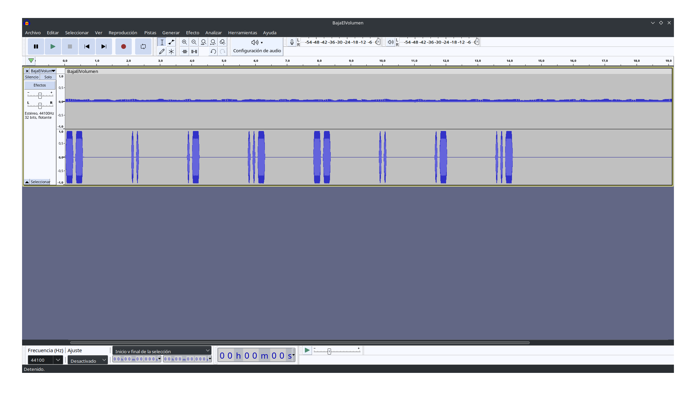

# Gatito Comilón

## Enunciado del Reto

>Mi amigo francés Vignère me queria enseñar una canción que hizo el otro día, pero su gatito se ha comido la llave de la caja donde estaba guardada. No paraba de decirle "ZXNjdXBlIQ==" para que se la diera.

## Archivo/s

- [caja_fuerte.zip](./caja_fuerte.zip)
- [gatito.jpg](./gatito.jpg)

<details> 
  <summary><h2>Hints</h2></summary> 

<br>

- JPEG es uno de los formatos soportados por _steghide_, a la hora de usarlo sobre una imagen se suele necesitar una contraseña, fíjate bien en el enunciado.
- Vignère, además de ser un muy buen amigo mío, es un criptógrafo del siglo XVI que dió nombre a un cifrado polialfabético que emplea una clave para cifrar un mensaje. La clave y el mensaje se encuentran en la _caja\_fuerte_, aunque uno de los dos no se encuentra a simple vista (u oído).

</details> 

- - - 

<details> 
  <summary><h2>Solución</h2></summary> 

<br>

La imagen que nos dan está en formato jpg, uno de los soportados por la herramienta [steghide](https://steghide.sourceforge.net/). Por lo que podemos sospechar que se ha usado para incrustar algún tipo de archivo en la imagen.

Efectivamente steghide detecta un fichero, pero requiere una contraseña.
El enunciado nos da una pista, parece estar codificada en Base64.

>~~~
> $ echo "ZXNjdXBlIQ==" | base64 -d
> escupe!
>~~~

Probamos con esta contraseña y conseguimos extraer un fichero de texto plano.

>~~~
>$ steghide extract -v -sf gatito.jpg -xf salida
>Anotar salvoconducto:
>leyendo archivo stego "gatito.jpg"... hecho
>extrayendo datos... hecho
>revisando checksum crc32... ok
>grabando datos extraíos en "salida"... hecho
>~~~

El contenido del fichero es:

>~~~
>$ cat salida
>la clave de la caja es:
>61 62 72 65 74 65 20 73 65 73 61 6d 6f
>~~~

La clave parece estar en hexadecimal. Si lo convertimos a ASCII obtenemos:

```
abrete sesamo
```

Probamos a extraer el fichero comprimido con esta contraseña.

>~~~
> unzip -P "abrete sesamo" caja_fuerte.zip
>~~~

El contenido del zip es un fichero de audio. Parece ser un mensaje en código morse y algo de ruido de fondo.

Abrimos el fichero en Audacity para descifrar el morse y descubir qué es el ruido de fondo.



A simple vista no parece nada raro, pero al ver el espectro del audio descubrimos lo que parece una flag.


Tiene un formato parecido al de una flag `ECGOE{TomSitieWdcmvEfMouu}`, el morse lo podemos traducir a `MIAUMIAU`.

El nombre del amigo francés que menciona en el enunciado (Vignère) puede darnos una pista del cifrado utilizado en la flag.
Usando [Cyberchef](https://gchq.github.io/CyberChef/#recipe=Vigen%C3%A8re_Decode('MIAUMIAU')&input=RUNHT0V7VG9tU2l0aWVXZGNtdkVmTW91dX0), por ejemplo, podemos descifrar esto y obtener la flag

## Flag

```
SUGUS{LosGatosOdianElAgua}
```

</details> 